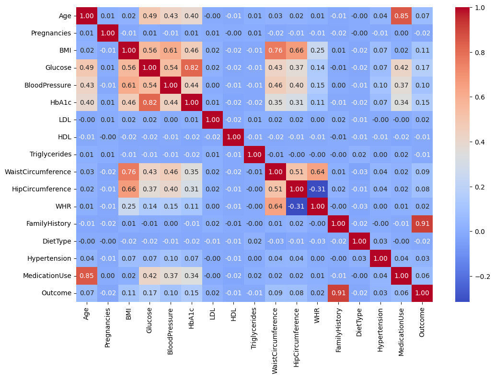
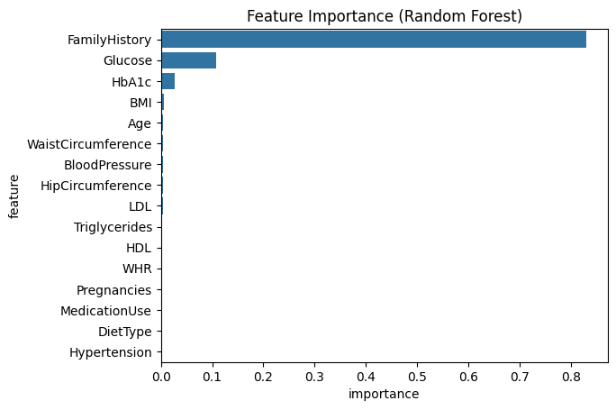
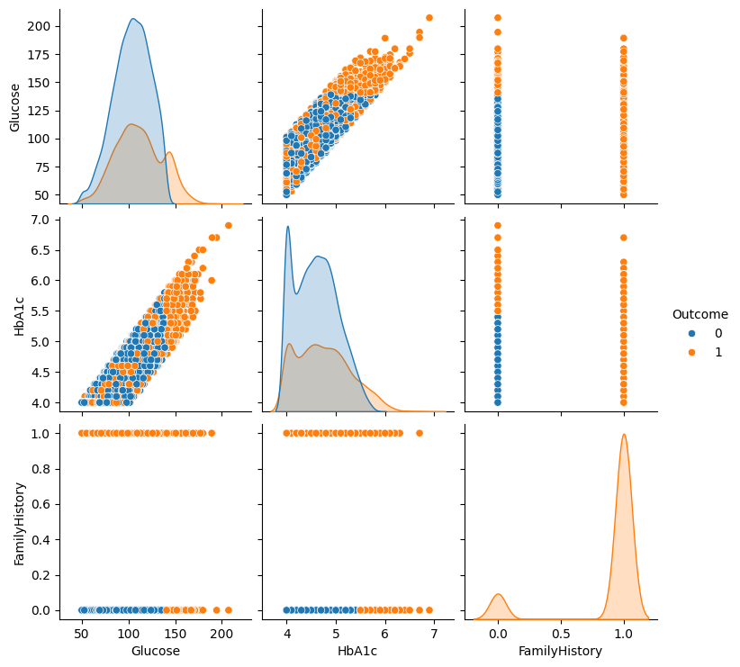

# 🏥 Diabetes Prediction: Data Science & Machine Learning

## 🚀 Overview
Diabetes is a growing health concern worldwide. This project utilizes machine learning techniques to predict diabetes risk based on patient data, helping in early diagnosis.

## 📝 Framework
- Data Preparation
- Exploratory Data Analysis (EDA)
- Data Correlation
- Feature Analysis
- Data Cleaning
- Modelling

## 🗃️ Dataset
Dataset is from https://www.kaggle.com/datasets/asinow/diabetes-dataset/data
Dataset contains 9,538 medical records with 16 features
| Feature Name  | Description                                  | Data Type  | Example |
|--------------|--------------------------------------------|------------|---------|
| Age      | Age of the individual             | Integer    | 40     |
| Pregnancies | Times patient has been pregnant          | Integer    | 13      |
| BMI          | Body Mass Index                          | Float    | 28.39    |
| Glucose          | Blood glucose level in mg/dL                    | Float    | 116.5      |
| BloodPressure | Systolic blood pressure     | Float | 104.4     |
| HbA1c | Hemoglobin A1c level (%)     | Float | 4.5     |
| LDL | Cholestrol level (bad)     | Float | 50.7     |
| HDL | Cholestrol level (good)    | Float | 39.1     |
| Triglycerides | Blood fat level     | Float | 117.0     |
| WaistCircumference | Waist measurement in cm     | Float | 108.9     |
| HipCircumference | Hip measurement in cm     | Float | 110.0     |
| WHR | Waist to hip ratio     | Float | 0.99     |
| FamilyHistory | Individual has a family history in diabetes (Yes = 1/No = 0)     | Integer | 0     |
| DietType | Individual's Diet type     | Integer | 0     |
| Hypertension | High blood pressure (Yes = 1/No = 0)    | Integer | 0     |
| MedicationUse | Medication's taken by Individual     | Integer | 1     |
| Outcome | Diagnosis result for Diabetes (Yes = 1/No = 0)    | Integer | 0     |

## 📊 Exploratory Data Analysis (EDA)
- In matrix correlation FamilyHistory has 0.91 score indicates leakage.

## 📑 Feature Analysis
- Feature importance:

- Pairplot Glucose and HbA1c:

- There is a strong correlation between Glucose and HbA1c (The higher the Glucose, the higher the HbA1c).
- FamilyHistory is a dominant factor.

## 🤖 Machine Learning Model
### Model Selection
There are four models tested:
- Logistic Regression
- K-Nearest Neighbors
- Random Forest
- Support Vector Machine

Average Cross Validation Result:
| Model | Avg Cross Validation Score |
|-------|----------------------------|
| Logistic Regression | 0.9899349959694071 |
| K-Nearest Neighbors | 0.99905627393783 |
| Random Forest | 1.0 |
| Support Vector Machine | 0.7249950854472506 |

Random Forest has the best score

###  Classification Report
Result from model evaluation using evaluation metrics:
- The model achieves a perfect accuracy of 100% in predicting diabetes and non-diabetes cases.
- There are no errors (no False Positives or False Negatives).
- Every diabetes case is detected, and there is no non-diabetes cases are misclassified as diabetes.
However, this result should be further tested because model that has perfect accuracy might indicate overfitting (model performs prefectly on this dataset but may not generalize well for new data)

Therefore, an additional test is conducted by comparing training accuracy with testing accuracy.

### Training Accuracy vs Testing Accuracy:
- Both training and testing accuracy are 100%, and cross-validation also achieves a perfect score of 100%.
There is a possibility that this perfect score is due to data leakage, caused by the FamilyHistory feature, which has a 100% correlation with Diabetes (the target).
- The FamilyHistory feature is still used because it is medically relevant.

### New Prediction with negative FamilyHistory
- The model is not overfitting, as it can still make correct predictions without the positive FamilyHistory feature.
It means, model is learning from other features.
- Although FamilyHistory is dominant, but Glucose and HbA1c are also considered.

## 🎉 Result
- Model Accuracy is 100%
- Model without FamilyHistory feature, accuracy is decreased significantly, it also happens in model that just has FamilyHistory feature. It can be concluded that these three features (Glucose, HbA1c, and FamilyHistory) are important.

## ✨ Contributors & Credits
👩‍💻 Arum Puspa Arianto - https://www.linkedin.com/in/arum-puspa-arianto-5b6a82152/